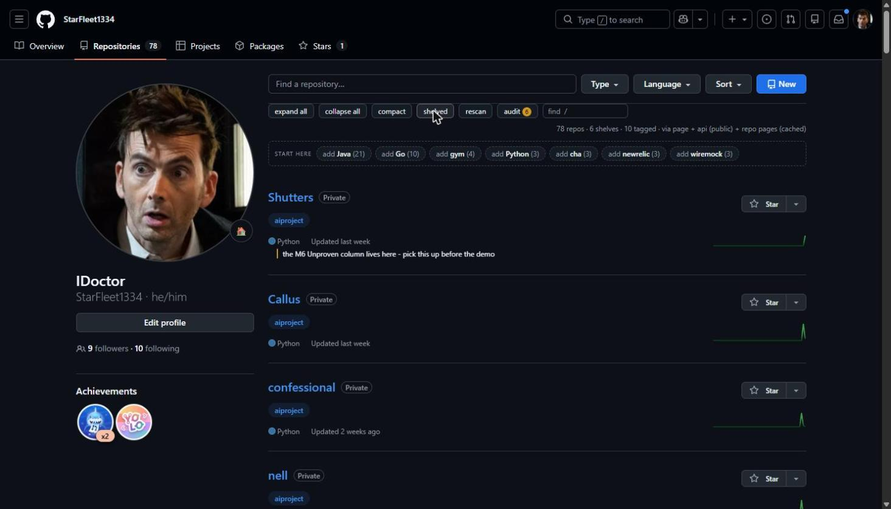
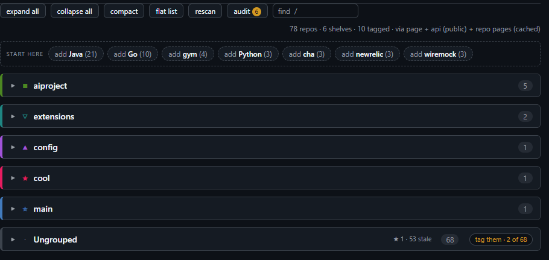
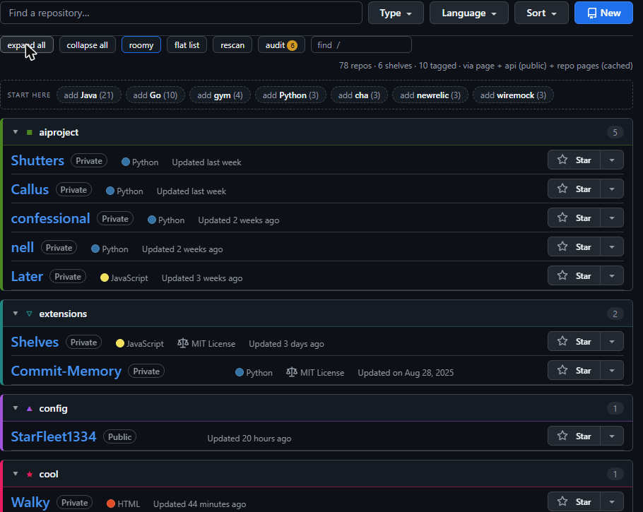
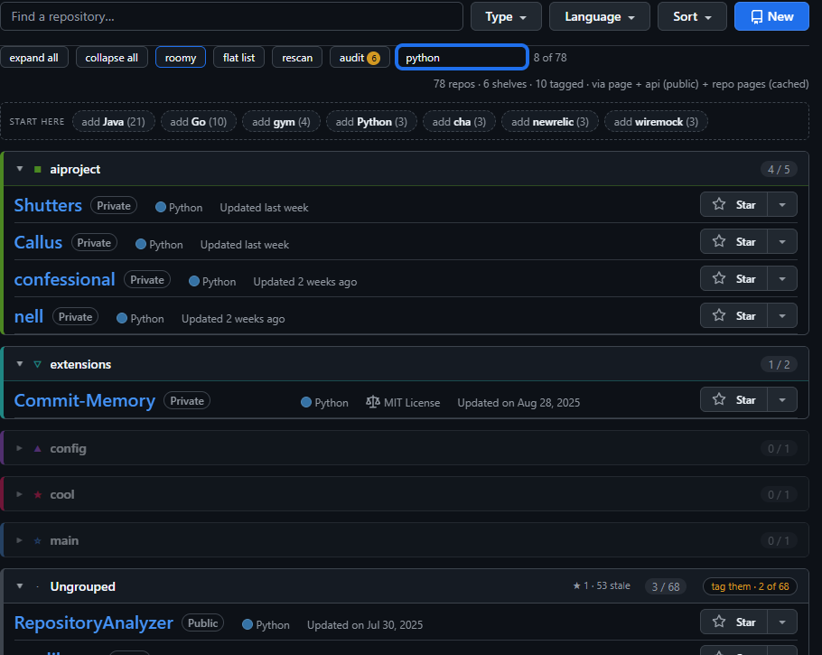
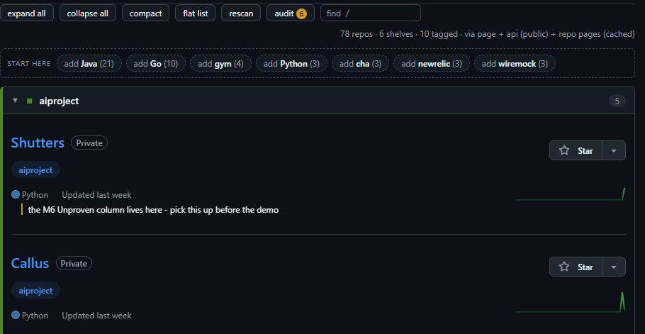
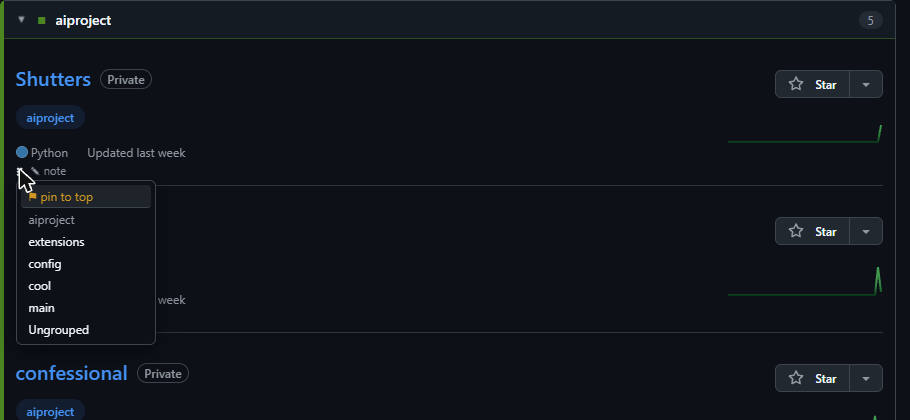
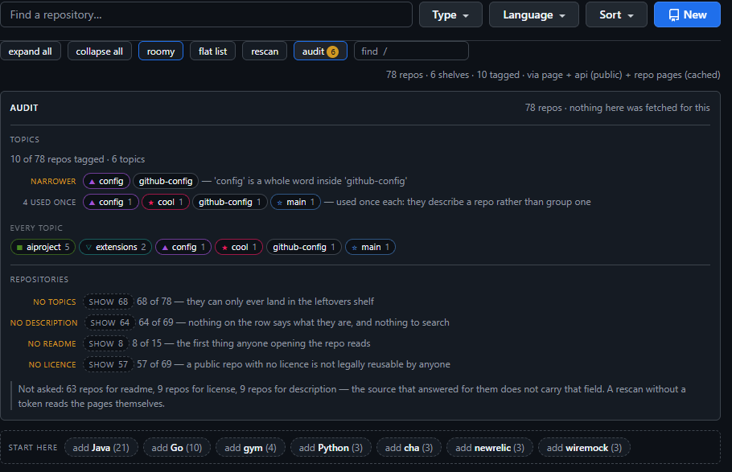
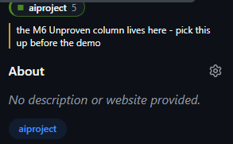
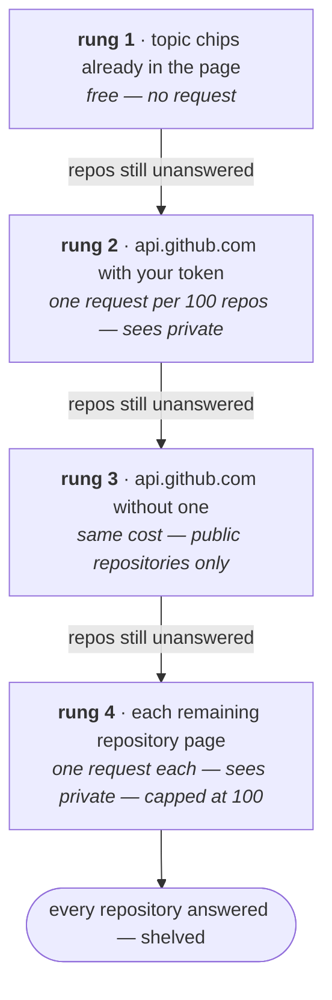

<div align="center">


# SHELVES

### Folders for GitHub's Repositories tab &mdash; built from the topics you already have

`github.com/<you>?tab=repositories` is one flat column.<br>
SHELVES re-draws it as named, counted, collapsible shelves, in the page you already open.

<br>


<br>


<br>


<sub><b>flat list &rarr; shelved &rarr; search &rarr; audit</b>, on a real 78-repository account</sub>

<br><br>

<a href="#install-and-run"><b>Install</b></a> &nbsp;&middot;&nbsp;
<a href="#the-page-as-an-instrument"><b>What it does</b></a> &nbsp;&middot;&nbsp;
<a href="#how-it-gets-the-topics"><b>How it works</b></a> &nbsp;&middot;&nbsp;
<a href="#trust-and-your-data"><b>Your data</b></a> &nbsp;&middot;&nbsp;
<a href="#known-limits"><b>Limits</b></a>

</div>

---

## The problem is one column

Three filters, a search box that matches names, and &mdash; on the account every number in
this README was measured against &mdash; **78 repositories in a single column**. There is no
folder, no group, no section. Nothing on that page can say *these five are the AI project
and those two are browser extensions*.

<p align="center">
  
</p>

The label system already exists. **Topics** &mdash; repo &rarr; About &rarr; &#9881; &rarr; Topics
&mdash; are free-form, unlimited, editable in two clicks, and already attached to the right
object. GitHub simply never renders a view that groups by them.

**SHELVES is that view.**

<p align="center">
  
</p>

Same page, same rows, same GitHub markup. Every shelf carries a hue and a glyph, so eight
shelves are one glance instead of eight reading tasks. Open one and your repositories are
underneath, exactly as GitHub rendered them.

<p align="center">
  
</p>

Then it does things the page cannot: `/` searches **descriptions, topics, languages,
licences and READMEs**; every row carries a **private note**; a shelf can be a **question**
(`Java = lang:java fork:false`); and **audit** reads your whole collection back to you.

It is a **lens, not an editor**. It never writes to your GitHub account, it talks to
exactly two hosts, and nothing it learns leaves your browser.

---

> [!TIP]
> Every section below with a **&#9656;** is collapsed. Click to open it &mdash; the same
> gesture the extension itself is built on.

---

## Install and run

There is **no build step**. The folder in this repo is the folder the browser
loads.

1. Open `chrome://extensions` (or `edge://extensions`).
2. Turn on **Developer mode**, top right.
3. Click **Load unpacked**, and choose the `extension/` folder inside this
   project — *not* the project root.
4. Go to `https://github.com/<your-username>?tab=repositories` and reload.

The first load asks the GitHub API once, and one request answers every public
repository you own. Only what it cannot see — your private repos — is read a
page at a time, behind a progress line: `reading topics from repo pages 34/76 —
cached after this`. On the 77-repo account this was last measured against that
came to **one API call and no repo-page reads at all**; an account that is
mostly private is ten to twenty seconds. Every load after that is instant.

You do not wait that out looking at the flat list. The page is shelved in the
first frame from the topic chips already on the rows plus whatever the cache
holds — **341 ms**, against 1 178 ms when the cache is cold — and re-shelves
itself when the ladder answers. See *the first frame*, below.

<details>
<summary><b>Tag some repos first</b> &mdash; SHELVES groups by topic, so a repo with no topics has nothing to group by</summary>
<br>

SHELVES groups by topic, so a repo with no topics has nothing to group by. On
any repo: **About** (right sidebar) → ⚙ gear → **Topics** → type a label →
Enter → **Save changes**. GitHub lowercases them, so `AiProject` becomes
`aiproject`.

SHELVES will never do that for you — writing a topic is a write. What it does
instead is queue the job and hand you the tab: see *the workbench*, below.

</details>

<details>
<summary><b>Before you have tagged anything</b> &mdash; suggested shelves, a one-tab-at-a-time walk, and moving repos by hand &mdash; none of which writes to GitHub</summary>
<br>

An account that has never used topics gets back the page it already had: one
shelf called Ungrouped holding everything. On the profile this was last measured
against — **54 public repos, 1 of them tagged** — every other feature here is
correct and useless. Three things answer that, and not one of them writes to
GitHub.

#### Suggested shelves

A strip above the shelves offers what the collection already says about itself,
each as `add <label> (N)`, ranked by reach and capped at ten. Three kinds:

- a **topic** several repos carry that is not a shelf yet — the strongest kind,
  because the shelving engine already matches topics
- a **shared leading word in the names** — `wiremock-api`, `wiremock-data` and
  `wiremock-demo` become `wiremock`, named for what they actually share rather
  than for `wire`. This is the only signal an account with no topics gives at all
- a **language** several repos are written in

That cold start offered `add Java (23)`, `add Go (11)`, `add Python (3)` and
`add wiremock (3)`.

Pressing one writes an **ordinary shelf** into your settings — editable,
reorderable and removable on the options page exactly like one you typed, with
no "suggested" state to migrate later. A name and a language are not topics
GitHub can match, so accepting one of those also **pins** the repos it named
using the overrides below; without that it would build a shelf and leave it
empty. Accepting `add wiremock (3)` gave `config 1 · wiremock 3 · Ungrouped 50`.

Two things it will not offer. A suggestion covering more than half the
collection is suppressed — **audit** already names that shape as a blanket
label, and a shelf holding half your repos is the flat list wearing a hat. And a
repo that already has a shelf is never counted towards a new one: an override
outranks every topic, so a repo pinned to `wiremock` can never land on a `Java`
shelf, however many times it is counted towards one.

#### The workbench

The leftovers shelf's own summary reads `53 untagged · tag them`. Press it and
the next untagged repo opens in its own tab, where the two-click edit — About →
⚙ → **Topics** — is the thing that actually fixes it for good. The label then
reads `tag them · 2 of 53`, and past the last one it wraps back to the start.
One tab per press, never a fan of thirty.

The count comes from the **topics**, not from the shelf: a repo you pinned by
hand is off the leftovers shelf and still untagged, and still worth tagging.
Your place in the queue is remembered per profile, so this is a chore you can
leave and come back to.

</details>

<details>
<summary><b>Choose your shelves</b> &mdash; the options page: your shelf list, private repos, behaviour</summary>
<br>

Click the extension's icon (or `chrome://extensions` → *Details* → *Extension
options*):

- **Your shelves** — the topics you want as sections, in order. A repo goes on
  the **first** shelf whose topic it carries. An entry with an `=` in it is a
  **rule** rather than a topic — see below — and the two kinds sit in one list.
  Leave it empty and SHELVES groups automatically by whatever topics it finds,
  biggest shelf first.
- **Private repositories** — nothing to do. It works with no token; see below
  if you want it faster.
- **Behaviour** — start collapsed, how long to remember topics, what to call
  the leftovers shelf. Concurrency, page depth and the rung-4 ceiling
  (`scrapeMax`, 100) are defaults in `src/store.js` and are not on this page
  yet; the ceiling has a button on the toolbar instead.

</details>

---

## A shelf can be a question

A shelf's name is normally a topic, matched literally. Put an `=` in the entry and the left
half is the name, the right half is the membership:

```
Live Python = topic:ai lang:python fork:false pushed:<90d
Java        = lang:java fork:false
Old Guard   = pushed:>2y
config
```

Thirteen fields, all `AND`-ed, `-` to negate, parsed **once per page** against records
already read &mdash; no request, no index, and no second axis.

<details>
<summary><b>A shelf that is a question</b> &mdash; the full grammar, and the three rules a rule shelf keeps so it cannot lie to you</summary>
<br>

A shelf's name is normally a topic, matched literally, and for a well-tagged
collection that is the whole answer. It cannot express the shelf people
describe out loud — *the Python ones I still work on*, *everything I forked and
never touched* — because those are three fields and a date. Put an `=` in a
shelf entry and the left half is the name, the right half is the membership:

```
Live Python = topic:ai lang:python fork:false pushed:<90d
Java        = lang:java fork:false
Old Guard   = pushed:>2y
config
```

An entry with no `=` is the plain topic shelf SHELVES began with, so both kinds
live in **one list, in one order**, and there is nothing to migrate. The rule is
parsed **once per page** and applied to the rows already on it — no request, no
index, no second axis. A repo still lands on the **first** shelf that takes it,
tried in the order you wrote them, so there is no new precedence to learn.

| term | matches |
|---|---|
| `topic:` `topics:` | one of the repo's topics |
| `lang:` `language:` | the language, **exactly** — `lang:java` is Java, never JavaScript |
| `license:` | the licence, exactly — `license:mit` |
| `name:` | anywhere inside the repo's own name, without the `owner/` |
| `desc:` `description:` `readme:` `homepage:` | anywhere inside that text |
| `fork:` `archived:` `private:` | `true` or `false` (`yes`/`no` also read) |
| `stars:` `forks:` | a number, with `>` `<` `>=` `<=` — `stars:>10` |
| `pushed:` `updated:` | an age **with a unit** — `90d`, `6m`, `2y` |
| a bare word | anywhere in the name, the description or the topics |

Every term is `AND`-ed. There is no `or` and there are no parentheses: two
ideas are two shelves, which is the model the rest of this extension already
has. A leading `-` negates one term (`-topic:demo`, `-name:test`). And
`pushed:<90d` reads as *pushed within the last 90 days* — the plain-English
sense, which is the reverse of the arithmetic; `pushed:>2y` is *not touched in
two years*.

Three rules a rule shelf keeps to, each of which is a way it could have lied
instead:

- **A term nobody can judge excludes the repo, and the shelf says how many.**
  `fork:false` against a record that came from the topic chips on the row is not
  false — it is *unknown*, and answering an unknown as false is how a shelf
  quietly fills with the wrong repos. Those repos stay on the leftovers shelf,
  which is this project's safe failure everywhere else too, and the rule shelf's
  own header states `N unjudged`.
- **A term nobody can parse is named, never dropped.** `Oops = lang:python
  topc:ai pushed:90` has two: a misspelt field and an age with no unit. The
  toolbar prints `unreadable in Oops: topc:ai pushed:90` and the rest of the
  rule still applies. A shelf that silently ignores a third of itself leaves you
  looking at contents you cannot explain.
- **First match still wins.** A rule shelf is tried exactly where its entry sits
  in your list, and a repo that satisfies two of them is on the first one only.
  What the second one would have said is given back as a chip on the row — see
  *the shelves a row also matched*, below.

**A rule shelf is allowed to be empty, and that is not always a bug.** The
example this feature was sketched from — `topic:ai lang:python fork:false
archived:false pushed:<90d` — returns **zero** on the profile it was measured
against, because that account has **1 tagged repo of 54** and **1 repo pushed
inside two years**. The grammar is sound; the collection is sparse, which is the
same fact the first-day features above exist for. Written against terms that
collection can actually answer — `Java = lang:java fork:false`,
`Recent = pushed:<180d`, `Old Guard = pushed:>2y`, `config` — the same 54 repos
came out **Java 26, Recent 1, Old Guard 23, Ungrouped 4**.

The other reason a rule shelf comes back thin is that nobody could look. A rule
can only ask what the record's source actually carries, and a repo answered by
its own page carries no language and no push date — GitHub renders the languages
bar and every timestamp on the client now, so they are simply not in the HTML
SHELVES reads. On a scraped collection a `lang:` or `pushed:` term reports every
repo as `unjudged` rather than answering "none", which is the difference between
*you have no Python* and *nobody could look*. A token moves those repos to the
API, which does carry both.

</details>

<details>
<summary><b>What a shelf is worth</b> &mdash; stars, stale count, and <code>N since you were here</code> &mdash; the one thing GitHub cannot tell you</summary>
<br>

The header used to carry a count. The records to say more were already read —
one repo page gives up ten fields — so it now carries three more things (and a
fourth on a rule shelf), before the count and quieter than it:

```
▾ Java                                     ★ 1 · 26 stale                     26
```

- **`★ <n>`** — stars totalled across the shelf.
- **`<n> stale`** — repositories with nothing pushed in a year.
- **`<n> since you were here`** — repositories pushed since your last visit to
  this page. **This is the one GitHub cannot say.** It knows when every repo was
  pushed and has no idea when you last looked; that timestamp is
  `shelves:seen:<owner>` in this browser's storage, read and stamped **once per
  visit**. Once, and not per render: the page draws itself twice (the first
  frame, then the ladder's answer) and again after a Type or Language filter, so
  a stamp per render would make "since you were here" mean "since a few hundred
  milliseconds ago" and the answer would be zero forever.
- **`<n> unjudged`** — on a rule shelf, how many repositories that rule could
  not decide about because a term named a field their source cannot carry. They
  are on the leftovers shelf.

**It says nothing rather than zero.** A page answered entirely by the topic
chips on the rows carries no stars and no dates at all, and `★ 0 · 0 stale`
would be a statement about your collection when it is a statement about the
source that answered. That is the same test the audit uses to decide a
denominator, and it is now the same table.

</details>

<details>
<summary><b>The shelves a row also matched</b> &mdash; first match wins the row; the rest come back as chips that cost no height</summary>
<br>

First match wins the row, and it has to: a repo on two shelves is two counts
that do not add up and a list you cannot scan once. But what that rule throws
away is real — knowing `wiremock-api` is on `tooling` and would also have been
on `Java` is most of what you want when a shelf looks thin. So a row wears small
chips naming the other shelves it matched, up to four and then `+n`.

They ride in the same margin as the note and the grip, which on a row with no
note is parked in the padding GitHub already leaves under every row — so they
cost the row **no height**. They are drawn and not pressable: a chip you could
click would mean *put it there*, which is what the grip is for, and would
quietly become a second way to write an override.

Auto-grouping draws none of them. With no shelves configured there is one shelf
per topic, so every chip would be a restatement of the row.

</details>

---

## The page as an instrument

### Find anything

<p align="center">
  
</p>

Press `/` anywhere on the page — or click the box in the toolbar — and type.
It matches the repo's **name, description, topics, language, licence, the
first line of its README, and your own note**, all of which SHELVES read once
and cached. GitHub's own filter box matches names only, which is why *"the one
about rate limiting"* is findable here and not there.

Shelves show `hits / total` while you search, and a shelf with nothing in it
dims rather than disappearing — the shelves are the map, and a map that
reshuffles while you search it is harder to read. `Esc` clears.

### The keys

The shelves are the navigation now, so they answer to the keyboard:

| | |
|---|---|
| `/` | the filter, focused and its text selected |
| `j` / `k` | the next / previous shelf |
| `1`–`9` | that shelf, opened |
| `e` / `c` | expand / collapse every shelf |
| `Esc` | clears the filter, in the box itself |

`j` and `k` move **focus**, not just the scroll — focus is what a screen reader
follows and what `Enter` or `Space` then acts on — and they wrap round rather
than stopping dead at the end. A digit opens the shelf it lands on, because a
shelf you jumped to and cannot see is not a jump; only the first nine are
reachable that way, and a digit naming no shelf is left alone for GitHub.

Every one of them stands down inside a field — GitHub's own boxes and this
extension's note editor included — so the only keys they ever take are ones
pressed while reading. A modified key is the browser's: `ctrl`+`J` is the
download shelf and a shortcut that eats it is a bug in somebody else's app.

`/` in particular is **taken rather than shared**. GitHub binds it on the
document too, and their script runs long before a content script does, so their
listener fires first — measured, our `/` was opening GitHub's quick-search
overlay on top of the page. The map is registered in the capture phase and stops
the key there.

<details>
<summary><b>One line per repository</b> &mdash; 109px &rarr; 41px per row; nine rows on a screen &rarr; twenty-four</summary>
<br>

Press **compact** in the toolbar. GitHub draws a repository row 109px tall —
24px of padding either side of a heading, a description it may not have, a topic
row it may not have and a footer line — which on 77 repos is eight screens to
read a list, and the shelves cannot help because the shelves are not what is
tall. Measured on a real profile: **109px → 41px per row, nine rows on a screen
→ twenty-four.** Press **roomy** to go back.

It is a reading posture, not a second rendering path. Nothing is removed from
the row: the description, the topic chips and the commit graph are hidden by
CSS, so `/` still searches every one of them and pressing `roomy` gives them
straight back — the same reason the rows are GitHub's own elements in the first
place.

The choice is remembered **per profile**, in this browser only. It deliberately
does not sync: the right density depends on the screen, and a 27-inch monitor's
answer is the wrong one on a laptop.

</details>

### A private margin

<p align="center">
  
</p>

Hover any row and a small `✎ note` appears. Write anything: *"the one with the
broken deploy"*, *"client wants this back in March"*. `Enter` saves,
`Shift+Enter` makes a new line, `Esc` cancels.

Notes are **yours, not the cache's**. They live in this browser, never travel
to GitHub or to your other machines, are searchable by `/`, and — unlike
topics, stars or anything else on the page — nothing can rebuild one if it is
lost. So *rescan* and *clear cache* both leave them strictly alone, which the
charter states as the single exception to principle I.

Press **Save**. The GitHub tab reloads itself.

### Put a repo on a shelf yourself

<p align="center">
  
</p>

Some repos will never carry a topic, and some carry one that says the wrong
thing. Hover a row and a grip `⠿` appears in the note margin beside the pencil:
**drag it onto a shelf**, or **press it** for a list of the shelves that exist.
Two gestures, one write — dragging is the one that feels like shelving, and the
menu is the one that works from a keyboard and does not need a steady hand on a
77-row page.

An override **outranks every topic**, and it is the only thing here that can
shelve a repo with no topics at all — which on an untagged account is most of
them. It is stored against `owner/name` in this browser, which is what keeps
this a lens: nothing reaches GitHub, and uninstalling undoes all of it.

Moving a repo writes **one key** and re-homes **one row**. There is no reload, so
you keep your scroll, your open shelves and the search you were in the middle
of. Dragging a row out of Ungrouped onto `config` took the counts from 1 / 53 to
2 / 52 with nothing else on the page moving — and after a full page reload it
was still 2 / 52.

Moving a repo back onto the leftovers shelf **deletes** the key rather than
storing an opinion you have withdrawn. For a repo that *does* carry topics,
though, moving it to the leftovers shelf is a real instruction and is stored as
one — otherwise the row would slide over, the counts would change, and the next
load would put it straight back where its topics say it belongs. And like your notes, overrides are yours
rather than the cache's: *rescan* and *clear topic cache* leave them strictly
alone, for the same reason — no request re-derives one.

The menu lists only shelves that already exist. Inventing a shelf is what the
suggestions are for, and an override naming a shelf nothing draws would put the
row somewhere the page cannot show it.

#### Pin it to the top

The same menu's **first** entry is `⚑ pin to top`, because the top of a shelf is
part of where a repo goes and does not need a second control of its own. A
pinned row rises to the top of the shelf it is already on and wears a mark down
its left edge; the same entry then reads `⚑ unpin`.

Pinned rows are a **stable partition, not a sort**. The order inside a shelf is
GitHub's — your own `Sort` setting on the page — and rearranging it is not this
extension's business. The only claim being made is *these few first*, so
everything else stays exactly where GitHub put it. Pinning a repo puts it
**below** the ones already pinned, so pinning three in a row does not reverse
them, and unpinning drops a row back under the pinned ones rather than to the
bottom of the shelf.

Pins live in this browser against `owner/name`, like your notes and your
overrides, and like them *rescan* and *clear topic cache* leave them strictly
alone — no request can re-derive which three repositories matter to you this
month. Those three are the whole of that category.

<details>
<summary><b>Shelf identity</b> &mdash; a colour and a glyph: twelve hues and twelve glyphs, walked independently, measured for tofu and for contrast on both themes</summary>
<br>

Every shelf gets a hue and a shape, so eight shelves are one glance instead of
eight reading tasks.

The mark is a **hash of the shelf's own name**. Nothing is stored, nothing
syncs, nothing can be lost, and the same shelf is the same colour on every
machine you use, forever. The trade is that you cannot pick a colour and that
renaming a shelf gives it a new one — both stated in the charter, and both
cheaper than a settings key that would need a default, a migration and an answer
for a renamed shelf.

There are twelve hues and twelve glyphs, and they are walked **independently**.
Up to twelve shelves, either channel alone identifies one: twelve distinct
colours *and* twelve distinct shapes, so a reader who cannot separate two of the
hues still has the shapes. Above twelve, the identity is the **pair** — 144 of
them — and one of the two channels necessarily repeats, because there are only
twelve colours. Two shelves may then share a hue, and the glyph is what tells
them apart. That is the two channels degrading one at a time, which is what a
second channel is for.

It is worth stating because the opposite shipped: one slot used to drive both
channels, so the thirteenth shelf wrapped and got a duplicate hue **and** glyph
together — both channels failing at once, which is the one thing the design
exists to prevent. Twelve shelves is not a corner case either; auto-grouping
makes one shelf per distinct topic, and accepting a suggestion makes a
thirteenth a single click.

The leftovers shelf stays deliberately outside the palette — it is a remainder,
not an idea.

Both halves were measured in a real browser rather than eyeballed. `●` and `□`
turned out to be **tofu** in GitHub's own font stack on Windows — the
missing-glyph box, which at 10px passes for a marker — and a single lightness
across all twelve hues put four of them below 3:1 on the light theme. Every hue
now solves for its own lightness and clears **4.3:1 against both** `#ffffff` and
`#0d1117`, with no theme detection anywhere. See `tests/identity.html` and
`tests/glyph-probe.html`.

</details>

### Audit

<p align="center">
  
</p>

Press **audit** in the toolbar. It opens one panel with two sections, because
they are two questions about one collection: what is wrong with your **topics**,
and what is missing from your **repositories**.

#### Topics

GitHub will show you one repo's topics, and
it will show you every repo carrying one topic — but nothing anywhere shows you
your labelling vocabulary *as a whole*, which is exactly why it rots: every
individual decision looked fine.

The panel names five things, and **draws what is certain differently from what
is a guess**:

| | |
|---|---|
| **one idea** | `ai-project` and `aiproject` are the same letters. Arithmetic, so they are merged and counted as a **union** of repos — two spellings across three repos is three, not four |
| **narrower** | `ai` is a whole word inside `ai-project`. A suspicion, never merged |
| **typo?** | `kubernetes` and `kubernets` are one character apart. Also a suspicion |
| **blanket** | a topic on 5 of 6 tagged repos separates almost nothing; as a shelf it reproduces the flat list |
| **used once** | a topic on one repo describes that repo. It will make a shelf of one |

The count rides on the **closed** button, because a panel nobody opens tells
nobody anything. Every topic is listed below the findings, and pressing one
filters the page to the repos wearing it — a search you could not previously
express. Topics that are already shelves wear that shelf's own mark, so the
panel and the page below it are visibly the same map.

It reads the topics the ladder already resolved: no request, no storage, and
nothing written anywhere. Acting on what it says is still your job on GitHub,
because editing topics would be a write and principle I says no.

#### Repositories

The other half counts what is missing across the whole collection — no topics,
no description, no README, no licence — and what is archived but still shelved
among live work. GitHub can tell you *one* repo has no description; it has never
told anyone they have twelve, and twelve is the number that changes an
afternoon.

Each finding has a **SHOW** button that filters the page to exactly those repos.
That is a second addressing mode, not a search: *"the 12 with no description"* is
not a substring anyone could type, so it addresses rows by name and the find box
goes empty rather than filling with something unreadable. Your next keystroke
drops straight back into text search.

**The denominators are the honest part.** A count reads *2 of 4*, not *2 of 6*,
because two of those repos were answered by the GitHub API — whose body carries
no README at all — and asking them about a README would be reporting the API's
shape as your failing. On an account with a token, that would be every repo you
own. Whatever could not be asked is printed under the findings rather than
silently narrowing the denominator. This is principle XIII in the charter, and
it is there because an audit that quietly over-reports looks exactly like one
that works.

The caveat shrinks as the ladder climbs. A repo answered by page chips alone
carries three fields and can be asked about nothing else, so a run that stopped
at rung 1 could only report *not asked* about the whole collection: on the
77-repo account, making rung 1 a floor moved that line from **readme, licence
and description** to **readme alone**, and three real gaps appeared underneath
it that had been invisible.

### The mark on a repo's own page

<p align="center">
  
</p>

Open any of your repositories and a chip sits at the top of the About sidebar:
the shelf's glyph, its name in its colour, the shelf's size, and a link back to
the shelves. Your private note comes with it, editable right there — which is
where you actually are when you remember something about a repo.

It is beside the topics on purpose. The shelf is the *consequence* of the
topics, and putting the answer next to its own input is the only placement that
needs no explaining.

**It fetches nothing.** Every input is already on the page or in local storage,
which is what makes it safe on a page you opened to read code.

The colour needs the whole collection to be correct — palette collisions are
resolved across every shelf at once — so the Repositories tab writes the shelf
list down and this page reads it. Without it (you have never opened your
shelves, and you are auto-grouping) the chip still names the shelf and simply
**declines to claim a colour**. A mark that disagrees with the shelves would be
worse than no mark.

---

## How it gets the topics

Four rungs, climbed from free to expensive, stopping the moment every repository is
answered. **Rung 1 is a floor, not an answer** &mdash; what the page gives up for free is
kept, and every repo it did not name still climbs.



The toolbar names **the rungs that contributed**, never just the first one &mdash;
`via page + api (public) + repo pages (cached)`. And you do not wait it out looking at the
flat list: the page is shelved in the **first frame** from the chips plus whatever the cache
holds, measured at **341 ms** against 1 178 ms on a cold cache, then re-buckets itself when
the ladder answers.

<details>
<summary><b>Where the topics come from</b> &mdash; the four rungs in full, why rung 1 had to become a floor, and the ceiling on rung 4</summary>
<br>

Four rungs, climbed from free to expensive, stopping the moment every repo is
answered:

1. **the topic chips already in the page** — free, no request
2. **`api.github.com` with your token** — one request per 100 repos, sees private
3. **`api.github.com` without one** — the same cost, public repos only
4. **each remaining repo's own page** — one request each, sees private

**Rung 1 is a floor, not an answer.** GitHub renders chips on some rows and not
others — 9 of 77 on the account this was re-measured against — so what the page
gives up for free is kept, and every repo it did not name still climbs. Until
2026-08-23 one chipped row ended the ladder for the whole collection: 68 repos
in Ungrouped, zero requests, nothing on the toolbar to say anyone had been
skipped, and no descriptions, READMEs, languages or licences for `/` to search,
because a chip is three fields and a repo page is ten.

So the source line is a **list of the rungs that contributed**, not one name:

```
via page
via api (token)
via page + cache
via already read
via page + api (public)
via api (public) + repo pages (cached)
via page + api (public) + repo pages
```

One name was enough while a run could only ever be one rung. With chips as a
floor a render is routinely two or three, and naming only the first would hide
the requests that answered most of the collection.

**Rung 4 has a ceiling.** It reads at most `scrapeMax` repositories in a pass —
100 by default, and a default rather than an option, because the options page
does not expose it yet — and the toolbar then grows a `read N more` button that
lifts the ceiling for exactly one pass. Everything the first pass read is
cached, so continuing costs only the repos that were deferred.

A deferred repo is **not** counted among the `N unread`: unread means we tried
and failed, and its cure is *rescan*. And it is not drawn as a warning, because
nothing went wrong — a limit you can lift is a choice offered, and filing it
beside `token rejected` would teach you to read a choice as a fault.

</details>

<details>
<summary><b>The first frame, before the ladder answers</b> &mdash; 341 ms to a usable page, corrected rather than redrawn &mdash; and why none of it is written down</summary>
<br>

A cold run is one request per repository, and until it finishes you would be
looking at the flat list you opened the page to get away from. Two sources cost
nothing and are already here: the topic chips GitHub renders on the rows, and
every repository the cache has read on a previous visit. The page is shelved
from those immediately, and re-shelved when the ladder actually answers.
Measured on the live profile: **341 ms to the first frame**, against 1 178 ms
with a cold cache.

While it is provisional the source line says `via page + cache` — it will never
name a rung that has not run — and the shelves you see then are a guess that
may be corrected: a shelf can appear, and a repository can move once.

**Nothing about that first frame is written down.** Not which shelves you left
open, not the shelf map another page would colour its chip from — a guess that
outlived the guessing would be a shelf order the finished page disagrees with.

The correction **re-buckets the page rather than redrawing it**, which is why
you can use it straight away: whatever you typed in the find box is still
there and still applied, an open audit panel keeps your place in it, a shelf
you opened stays open, and keyboard focus does not move. A row only moves if
its shelf changed.

It helps exactly where the waiting is. The cache only ever holds repositories
read from their own pages — the private ones the API cannot see — so an account
the API answers in one call has nothing cached, skips this, and loses nothing
by it.

</details>

<details>
<summary><b>GitHub's own filters</b> &mdash; Type and Language swap the rows underneath us; the answer and what you typed both survive it</summary>
<br>

The **Find a repository** box beside the shelves is GitHub's and still theirs:
it is a server-side search, and nothing here touches it.

The **Type** and **Language** menus are a different thing. They do not reload
the page — they fetch, and then replace the whole list underneath us with new
rows. The shelves are rebuilt around whatever comes back, and two things
deliberately survive that:

- **the answer.** Every repository this visit has already resolved is
  remembered for as long as the tab is open, so touching a dropdown costs
  **zero** requests rather than re-reading the collection. The source line then
  reads `via already read`.
- **what you typed.** The find box is refilled and the filter re-applied.
  Measured through the real dropdown: before `2 of 54`, after
  `26 repos · 1 shelves · 0 tagged · via already read`, the box still reading
  `gym` and the count `1 of 26`.

A filter that came from the **audit** is not restored, on purpose — it names a
specific list of repositories, and the new list may not contain them. A filter
that silently means something else is worse than no filter.

The memory lives only in the page, so it dies when the tab does: a reload reads
the ladder again, and *rescan* is unaffected by it.

</details>

<details>
<summary><b>Keeping the cache warm (off by default)</b> &mdash; opt-in, one at a time, never on your Repositories tab, stops dead on the first refusal</summary>
<br>

A first run that reaches rung 4 is ten to twenty seconds of fetching, and the
cache expires, so it comes back every week. Turn on **Keep the cache warm in the
background** in options and SHELVES refreshes the stalest few entries while you
are elsewhere on github.com.

It is off by default and stays that way, deliberately: everything else here
spends a request on a page you opened to see the result, and this spends them on
pages you opened for something else. That is a different kind of cost and it
needs its own consent.

The guards are the feature. It runs **only** where you are already on GitHub,
**never** on your Repositories tab (the ladder owns that page), **never** in a
background tab, one repo at a time with a gap, at most six per page you visit,
stalest first — and it **stops dead on the first refusal**, because a background
job that retries into a rate limit is how a convenience gets the foreground
throttled.

It refreshes what it has already seen and never discovers. A first run is still
cold; the point is that the second week is not.

</details>

<details>
<summary><b>On other people's profiles</b> &mdash; free rungs only, no token, no scraping, and every verb that would write your setup is simply not drawn</summary>
<br>

The shelves work on anyone's Repositories tab, but on a profile that is not
yours they use the **free rungs only**: topic chips already in the page, plus
the public API for that username. One or two requests, no token, no repo-page
scraping, and nothing written to your cache.

That is a deliberate narrowing, not a limitation. Your token answers *"what are
**my** repositories"*, which tells you nothing about somebody else's page — so
sending it there spends a credential on a request that cannot use it. And rung 4
would fetch every one of their repos with your session cookie: on a 600-repo
account, six hundred authenticated requests for one click on a link. The source
line lists the rungs that answered and ends `· not yours`, so the narrowing is
visible rather than assumed.

**The three first-day verbs stand down there too**, and for a sharper reason:
they write *your* setup. A suggestion accepted on somebody else's page would put
their topics into your `groups` — synced, on every machine — and pin their repos
in your store; and because the first entry in `groups` turns auto-grouping off,
your own profile would then draw one shelf with everything in it. So on a
profile that is not yours there is no suggestions strip, no walk and no grip.
The reading half is untouched: the page is still shelved, still searchable and
still audited.

</details>

<details>
<summary><b>When GitHub's page moves</b> &mdash; a moved selector is said out loud rather than silently absorbed &mdash; and below five pages read, there is deliberately no opinion</summary>
<br>

The repo page will be restructured eventually, and today that failure would be
silent: selectors return blanks, descriptions vanish, and the toolbar goes on
saying everything is fine — because a dead selector and a repo with nothing
filled in produce exactly the same record.

So each parse records which **anchors** it could find, separately from what they
said. If most of a run's pages come back without them, the toolbar says so:

```
76 repos · 1 shelf · 0 tagged · via api (public) + repo pages · GitHub's repo
page changed shape — shelving is unreliable: read 41 pages, found the About
sidebar on 0
```

Below five pages read there is deliberately **no opinion** — at that sample a run
of genuinely sparse repos is indistinguishable from a dead selector, and a canary
that cries wolf is turned off within a week.

It can only ever speak about pages rung 4 actually read, which is a second
reason rung 1 had to become a floor: a run that stopped at the chips read no
page at all, so the run that would have noticed the sidebar moving was the run
that never happened.

</details>

> [!WARNING]
> **Do not paste a classic personal access token.** Its finest grain is `repo`, which can
> *write* to every repository you own. SHELVES would never use a byte of that &mdash; which is
> the problem: you would be storing a key to your whole account, unencrypted in a browser
> profile, to save one request per repository. Use a fine-grained token with
> **Metadata: Read-only** and every other permission set to *No access*: the weakest
> credential GitHub can mint.

<details>
<summary><b>The optional token</b> &mdash; how to mint the right one in five steps, and what a rejected one does instead</summary>
<br>

Without a token, private repos' topics are read from your own repo pages using
the session you are already signed in with — one request per repo, up to the
ceiling, cached for a week. That is the default and it is correct; the token
only makes it faster.

With one, a single API call answers everything, private repos included, and the
toolbar reads `via api (token)`:

1. [github.com/settings/tokens?type=beta](https://github.com/settings/tokens?type=beta) → **Generate new token**
2. Repository access: **All repositories**
3. Permissions → Repository permissions → **Metadata: Read-only**
4. Every other permission: *No access*
5. Paste it into the options page and Save.

`Metadata: Read-only` is the weakest credential GitHub can mint. It cannot read
a line of your code and cannot write anything at all. It is stored in
`chrome.storage.local` — never in synced storage, so it does not travel to your
other machines — and is sent to `api.github.com` and nowhere else.

**Do not paste a classic token here**, and especially not one you already have
lying around. A classic personal access token has no permission finer than
`repo`, and `repo` can *write* to every repository you own — issues, code,
releases, settings. SHELVES would never use one byte of that, which is the
problem: you would be storing a key to your whole account, unencrypted in a
browser profile, to save one request per repository. The five steps above take
a minute and produce a credential that cannot do anything but list what you
already see.

**A rejected token falls back to a request, not to a label.** If it has expired
or been revoked, the toolbar says `token rejected (401)` and the run *re-asks
the public endpoint without the credential* before anything else — so the line
reads `via api (public) + repo pages`, and only what the public API genuinely
cannot see reaches rung 4. That branch used to set the label and skip the
request: it named a rung that had not run, and every repo fell through as
missing, which turned one dead credential into a page that read every
repository you own, one at a time.

</details>

---

## Trust and your data

> [!IMPORTANT]
> **It never writes to your GitHub account.** Not a topic, not a description, not a star.
> It contacts exactly two hosts &mdash; `github.com` and `api.github.com` &mdash; and there is no
> other network call of any kind in the codebase, and no server anywhere.

> [!CAUTION]
> **It does keep things locally, unencrypted.** Repository names (private ones included),
> descriptions, README openings, your notes, your overrides and your pins all live in this
> browser profile. MV3 offers no encrypted store, so that is inherent rather than chosen.
> **Anyone who can read this browser profile can read all of it.** Worth weighing before you
> install it on a shared machine.

<details>
<summary><b>Security</b> &mdash; what the risks actually are. Every risk follows from one fact: this is a content script with your GitHub session</summary>
<br>

Every risk here follows from one fact: this is a content script with your
GitHub session, and everything it keeps is on your disk.

**Everything is at rest, unencrypted, in your browser profile.** That is the
big one and it is inherent to extensions, not a defect: `chrome.storage.local`
is a file. It holds the token if you added one, your notes, your overrides,
your pins, a fact cache containing **private repository names and the opening
of their READMEs**, and a shelf map recording which shelf each of your repos is
on. Anyone with access to that profile reads all of it. If you share a machine,
that is the sentence to weigh. Uninstalling removes it; so does *Clear topic
cache* for the derived half.

**It runs on every github.com page you visit** — the whole origin, minus eight
excluded routes (`/settings/*`, `/login*`, `/sessions/*` and friends). It has
to: the shelf mark lives on repository pages. It means any parsing bug ships to
every page you open, including private repositories, which is why the row
parsers are structural and why `redteam.js` exists.

**A token is optional and its scope is the whole risk.** See *The optional
token* above: fine-grained, `Metadata: Read-only`, never a classic `repo` one.

**An export is a file with your private repository names in it.** That is the
price of being able to move your notes to another machine; the options page
says so beside the button.

What is *not* a risk, checked rather than asserted — `node tests/redteam.js`,
533 probes across six plugins:

- no name from a page can steer a request off `github.com`, through either
  sink that builds a URL by concatenation
- nothing in the extension names a host other than `github.com` and
  `api.github.com`; there is no `eval`, no `new Function`, and **no HTML sink
  anywhere in what ships** — every string from a page reaches the DOM as text
- no group entry, however long, takes more than linear time to parse
- a corrupt or hostile local store costs grouping, never sense, and no key from
  a file can reach `Object.prototype`
- the manifest asks for one permission (`storage`) and two hosts, declares
  nothing web-accessible, and lets no page talk to the extension

The searching half of that is the point, not the passing half. Two findings
from its first run are fixed and in the scars — and so is the fact that two of
its own probes were silently dead, because `` is a valid escape in Python and
became a backspace byte.

</details>

<details>
<summary><b>Getting your own work out</b> &mdash; export and import the three things nothing can rebuild &mdash; merging, never overwriting</summary>
<br>

Your **notes**, the repos you put on a shelf **by hand**, and your **pins** are
the only things here nothing can rebuild — no rescan re-derives a sentence you
wrote. They live in `chrome.storage.local` and nowhere else, deliberately:
they are too big for synced storage, and a credential's neighbours do not
belong there either. Which also means a profile reset, a new laptop or one
mis-click on *Remove extension* takes all three.

Options → **Your own work** → *Export…* writes them to a JSON file. *Import…*
reads one back.

Two things about it, both deliberate:

- **It merges, and the incumbent wins.** Where both sides know a repository,
  the note already in this browser stays. Importing is what you do when you are
  worried about losing something, and a silent overwrite of the sentence you
  wrote this morning is the one unrecoverable thing this extension could do.
  The result is counted — `12 added, 3 already here and left alone` — so
  "nothing happened" and "you already had all of it" are different sentences.
- **The token is not in it.** The file is something you are invited to move
  between machines; a credential is not.

A file is the most untrusted input SHELVES takes — the only one that does not
arrive through GitHub — so a key that does not name a repository, or a value of
the wrong shape, is refused and counted rather than stored. `redteam.js`'s
`import` plugin is that assertion.

</details>

<details>
<summary><b>What it stores</b> &mdash; the complete inventory, key by key, including what sits in <code>localStorage</code> rather than the extension's own store</summary>
<br>

In your browser profile, unencrypted, via `chrome.storage.local`:

- **the fact cache** — for every repo including private ones: name, description,
  language, stars, forks, licence, homepage, last-touched, and the README's
  first 400 characters
- **your notes** — one of the three things here that nothing can rebuild
- **your overrides** (`overrides`) — the repos you put on a shelf by hand,
  keyed `owner/name`. The second thing nothing can rebuild
- **your pins** (`pins`) — the repos you sent to the top of their shelf, keyed
  `owner/name`, as `{ "owner/name": true }`. The third, and the last: no
  request re-derives which repositories matter to you this month
- **the shelf map** — your shelf names, their counts, and your repo names
- **the token**, if you added one — `local` and never `sync`, so it does not
  travel between machines

Your shelf list itself — including any suggestion you accepted — is your
configuration and lives in `chrome.storage.sync`, with the rest of the options.

Entries are pruned once they have been untouched for four cache lifetimes (at
least 90 days), and the cache is capped at 3 000 repos. **Clear topic cache** in
options empties it now; your notes, your overrides and your pins are never
touched by it.

Three smaller kinds of thing sit outside all of that, in this browser's own
storage for github.com rather than in the extension's:

- `shelves:open:<owner>`, `shelves:bench:<owner>` and
  `shelves:density:<owner>` in `localStorage` — which shelves you left open,
  how far through the untagged repos the workbench has walked, and whether you
  read this profile `compact` or `roomy`. All three are places or postures
  rather than decisions: losing one costs you a scroll, a repeat of a tab you
  already closed, or one press of a button. Density is here rather than in the
  synced settings on purpose — the right density depends on the screen you are
  reading on
- `shelves:seen:<owner>` in `localStorage` — when you last opened this profile's
  Repositories tab, which is what `N since you were here` on a shelf header is
  measured from. Read and written **once per visit**, per profile, and
  deliberately never synced: *since you were last here* would otherwise mean
  *since you were last here on any of four machines*, which is not a sentence
  anyone wants. Losing it costs one visit's worth of that count and nothing else
- pressing `read N more` writes a single flag to `sessionStorage`, which the next
  load reads and deletes. It is not a setting — it is a decision about this tab,
  taken once — so it never syncs and a reload cannot silently repeat a large read
  you authorised once

None of this ever leaves the browser — but anyone who can read your browser
profile can read all of it, including private repository names and whatever you
wrote in your notes. MV3 has no encrypted store, so that is inherent rather than
a choice. Worth knowing before installing on a shared machine.

</details>

---

## Development

No build step. The folder in this repo is the folder the browser loads.

```bash
cd tests
npm install                     # jsdom, once — the extension itself has no dependencies
node harness.js                 # all 39 scenarios
node harness.js ladder-floor    # just that one

node redteam.js                 # 533 adversarial probes, six plugins
```

<details>
<summary><b>Running the tests</b> &mdash; 39 scenarios driving the real content scripts and the real service worker against a jsdom GitHub</summary>
<br>

```
cd tests
npm install                     # jsdom, once — the extension itself has no dependencies
node harness.js                 # all 39 scenarios
node harness.js ladder-floor    # just that one
node harness.js facts find      # two of them

node redteam.js                 # 533 adversarial probes, six plugins
node redteam.js settings        # one plugin, by keyword
```

Thirty-nine scenarios drive the real content scripts and the real service
worker against a jsdom GitHub.

</details>

<details>
<summary><b>The red team</b> &mdash; <code>harness.js</code> asserts the product does what it claims; <code>redteam.js</code> asserts hostile input cannot make it do anything else</summary>
<br>

`harness.js` asserts that the product does what it claims. `redteam.js` asserts
that hostile input cannot make it do anything else — and the two are different
questions, which is why they are different files. A finding there earns a
scenario here: the scenario is the regression test, the red team is the search.

**It is not a red team of a model, and it does not pretend to be.** The
published guides for red-teaming an assistant aim at prompts — jailbreaks,
encoding tricks, reasoning exhaustion — and none of it has any purchase here.
SHELVES contains no model, no prompt and no API to one, so that tooling would
return a clean report that means nothing. What transfers is the *method*:
adversarial cases grouped into plugins, generated rather than hand-picked, each
carrying a severity, exiting non-zero when something gets through, so it can
gate a commit. What changes is the threat model, which for a content script is:

> an attacker who controls a repository page the reader visits — its name, its
> topics, its description, its README, its hrefs — and, at the edges, a
> corrupted or hand-edited local store.

Five plugins ask one question between them: can any of that reach a URL, a
credential, the DOM as markup, or the CPU for long enough to freeze the tab.

- **`urls`** — every crafted owner/repo pair through `safeRepo` and into both
  sinks that build a URL by concatenation (`fetch("/" + name)` and the
  workbench's `window.open`). None may leave github.com. It also writes each
  accepted name into an object and asks the prototype afterwards, because the
  hazard is a key that IS `__proto__`, not a name that contains it.
- **`settings`** — `groups` is the reader's text, but it is text: it syncs
  between machines, it is written from page-derived suggestions, and it is
  parsed on every render. Every entry must parse in linear time, produce a
  bounded label, and — if nothing in it could be read — match **nothing**.
- **`store`** — the local stores with junk in them: a `topics` that is a
  string, an `updated` that is a word, an override that is an object, a
  `__proto__` key. A corrupt store must cost grouping and never sense.
- **`import`** — a backup file from anywhere, always through `JSON.parse` and
  never an object literal, because `{"__proto__": x}` written as a literal sets
  the prototype and `Object.keys` never sees the key — a probe built that way
  tests nothing. Keys that name no repository and values of the wrong shape are
  refused; a note already here is never overwritten.
- **`exhaustion`** — 5 000 repositories through the vocabulary, the audit, the
  suggestions and a 200-term rule, against a stated time budget.
- **`reach`** — the manifest's permissions and hosts, and a sweep of every
  shipped file for a host we do not own, for `eval`, and for any HTML sink.

Two findings from the first run are fixed and are in the scars: `topic:ai`
matched a `topics` value of `"chai-latte"` because `indexOf` is a substring
test on a string, and a corrupt override drew a shelf called `[object Object]`
holding real repositories. Neither is reachable from a live path today, which
is exactly why neither would have been noticed.

**Name a scenario by keyword, never by number.** A number is an index and it
moves: scenarios were appended, `harness.js 8` stopped meaning the ladder and
started meaning `facts` — which passes, so a milestone whose proof was a number
would have ticked itself. `harness.js ladder-floor` still means what it meant.
A keyword matches as a substring of the scenario's own name, and a selector that
matches nothing **fails** rather than passing emptily. Roadmap proofs are
written this way for the same reason, and this list was a numbered table for one
release too long — by the end its row 17 said `identity` while scenario 17 was
`credentials`.

- `network` — every row carries chips, the page alone is the whole answer, and
  it costs no network
- `ladder-floor` — chips are a floor: the repos they did not name still climb to
  the API and the repo pages, and the API never overwrites a chip answer
- `ceiling` — rung 4 stops at `scrapeMax`, says how many are left, and the
  continue reads exactly those and re-reads none of the rest
- `token-fallback` — a dead token re-asks the *public* API instead of reading
  every repo page one at a time
- `"no token"` — private repos resolve by page scraping, with no credential
  anywhere
- `"with token"` — one authenticated call, zero scraping
- `pagination` — page-2 repos are shelved, pager hidden
- `idempotence` — a second pass makes no second host, no nesting
- `"warm cache"` — zero repo-page fetches, and the toolbar says *cached*
- `rejected` — a 401 is said out loud, and the page still renders
- `facts` — one page read yields ten fields, topics still sidebar-scoped
- `find` — description, README, topic and language are all searchable
- `note` — written, painted, searchable — and survives a rescan
- `override` — the reader's own answer outranks every topic, shelves a repo with
  none at all, survives a rescan, and costs one write and no reload per move
- `suggest` — a cold start offers shelves rather than one dump: the prefix is
  named for what the repos share, a blanket label is not offered, a topic
  already on the page is not offered, accepting pins the repos a name cannot
  match, and the shelves already on screen survive the write
- `workbench` — the leftovers shelf counts the untagged from the topics, opens
  one tab per press, wraps past the last one, and never toggles the shelf
- `not yours` — on somebody else's profile the page is still shelved, still
  searchable and still audited, and every verb that would write the reader's
  own setup is simply not drawn
- `progressive` — the page is shelved from the chips and the cache before the
  ladder answers, says `via page + cache` while it is a guess, writes nothing
  down, and corrects itself into the same host — keeping what you typed, the
  rows it hid, and every listener on them
- `compose` — GitHub's own Type/Language swap costs zero extra reads and zero
  API calls, and the query you typed is put back and re-applied
- `density` — one attribute is the whole switch, it is remembered per profile
  and read before the first paint, and the row keeps every field it had
- `keyboard` — `/` `j` `k` `1`–`9` `e` `c`: focus moves, digits open, and
  fields and modified keys are left alone
- `rule-shelf` — a shelf may be a question: only the repo satisfying every term
  is on it, a topic shelf still works beside it in one list, an unreadable term
  is named in the toolbar rather than dropped, and the four ways a term can
  quietly mean something else — `lang:` exact, `name:` without the owner,
  `private:` actually carried, and a field the source cannot see reported as
  unknown rather than empty
- `weight` — stars totalled, stale counted, `since you were here` measured from
  a stamp taken once per visit — and nothing at all drawn on a source that
  carries neither stars nor dates
- `sibling-shelves` — first match still wins the row, the shelves it also
  matched are given back as chips, never the shelf it is on, and they sit in
  the note margin rather than in a line of their own
- `pin-top` — a pinned repo opens at the top of its shelf, pinning puts a row
  below the ones already pinned, unpinning drops it back under them, and the
  key is written and removed with it
- `backup` — the three things nothing can rebuild go out to a file and come
  back, merging rather than overwriting, refusing what a file should not carry
- `vocabulary` — families, suspicions, blanket labels and singletons, each drawn
  as what it is, and 3 000 topics in milliseconds
- `audit` — gaps denominated per field per source; a finding filters to its own
  repos
- `mark` — the shelf's mark on a repo page, with its note, at zero requests
- `mark follows` — a repo you pinned by hand wears the shelf you put it on,
  in that shelf's colour, on its own page
- `degrades` — no shelf map means no colour — never a wrong one
- `warm` — off by default, stalest first, bounded, stops on 429, never discovers
- `canary` — a moved selector is named; four pages is below the floor
- `credentials` — a stranger's profile costs no token, no scrapes and no cache
  writes, and is still shelved
- `backoff` — GitHub says stop, the run stops, and the toolbar counts the unread
  and names the cure
- `untrusted` — a page-supplied href is not a URL to fetch
- `forgets` — the fact cache is pruned by age and capped by count, newest kept
- `packaging` — one permission, two hosts, the excluded routes, the licence, and
  a storage claim that matches the code
- `identity` — a distinct hue and glyph per shelf, stable under any drawing
  order; above twelve the hue+glyph *pair* stays distinct to 144, and the two
  channels never repeat together

Two of those are phrases and need quoting, because the two token scenarios are
told apart by one word: `node harness.js "with token"`. Two more deliberately
overlap — `mark` runs `degrades` with it, `warm` runs `"warm cache"` with it —
which is a name covering both, where a number would have been a guess.

Several things in there are **not** checkable without a browser, and every one
of them shipped wrong once: `tests/row-layout.html` measures the note margin
against GitHub's real row, `tests/identity.html` + `tests/glyph-probe.html`
measure every palette slot for tofu and for contrast on both themes, and
`tests/mark.html` measures the repo-page chip inside a real 296px sidebar —
which is the only width at which a long shelf name can overflow. Photograph
them with anything that renders a page; jsdom computes no layout and cannot
tell a shape from the missing-glyph box.

One class of bug not even a fixture can see, because it is about how much room
we take on **GitHub's** page rather than about our own markup: `tests/row-
height.py` loads the unpacked extension into a real browser, opens a real
profile, and asserts that a shelved row is exactly as tall as GitHub's own —
switching each of our rules off in the live page to find out which one owns the
difference. It now also presses **compact** and measures the row again, because
that is the same kind of claim: jsdom computes no layout, so the harness can
assert the attribute, the toggle and the memory and nothing whatever about
whether the stylesheet made the row shorter.

**Run it signed in.** A signed-out profile is a different page, not a cheaper
sample of the same one: the lazy fragments GitHub ships inside a repo row only
refuse to load when they carry a nonce that is checked, and that is the
signed-in response. Merged rows there arrive with a fragment from another
page's nonce, fail without ever reaching the network, and reveal a full-width
error blankslate into a 145px column — 47 rows at 1 416px each, which reads as
blank because nothing in it is legible at that width. Measured signed out, the
same page is clean. The test now says so when it is run without a session.

Assertions are on counts and membership, never on "it did not throw".

**The harness cannot judge layout or event semantics.** After a change that
touches either, load it unpacked and look at the real page.

</details>

<details>
<summary><b>Layout</b> &mdash; every file in the tree, and what it owns</summary>
<br>

```
shelves/
├── CHARTER.md              principles, measured facts, architecture
├── ROADMAP.md
├── extension/              ← this is what you Load unpacked
│   ├── manifest.json
│   ├── background.js       service worker; the only caller of api.github.com
│   ├── options.html/.js    shelf editor, token, behaviour
│   ├── icons/              generated by tools/make_icons.py
│   └── src/
│       ├── store.js        settings · token · fact cache · notes · overrides ·
│       │                   pins · the one write to groups · collapse ·
│       │                   the bench · when you were last here
│       ├── dom.js          route detection, list finding, page merging
│       ├── facts.js        ONE parse of a repo page → ten fields, and which
│       │                   rung can answer for which of them
│       ├── rule.js         a shelf whose membership is a question, parsed once
│       ├── topics.js       the four-rung topic ladder; rung 1 is a floor
│       ├── vocab.js        the topics as a system, suggested shelves, the panel
│       ├── audit.js        the repos as a system: what is missing
│       ├── view.js         bucketing, rendering, shelf identity, what a shelf
│       │                   is worth, sibling chips, pinned rows first
│       ├── mark.js         route 2 — the mark on a repo's own page
│       ├── warm.js         route 3 — the opt-in background top-up
│       ├── main.js         lifecycle; one idempotent run()
│       └── shelves.css     themed off GitHub's own CSS variables
├── tests/
│   ├── world.js            fake GitHub: jsdom + chrome stub + real worker in a vm
│   ├── harness.js          the 39 scenarios, selected by keyword
│   └── package.json        jsdom, dev only
└── tools/make_icons.py     regenerates the icons from source
```

Read `CHARTER.md` before changing anything in `src/`. It carries ten principles
and seven facts that were established by measurement — several of the odder
lines in the code are load-bearing, and the charter is where the reasons live.

</details>

> [!NOTE]
> **The harness cannot judge layout or event semantics.** `tests/row-layout.html`,
> `identity.html`, `glyph-probe.html` and `mark.html` are photographed in a real browser,
> and `row-height.py` drives the unpacked extension against a real profile. jsdom computes
> no layout and cannot tell a shape from the missing-glyph box.

---

## Known limits

- **Chrome and Edge only.** Firefox's MV3 service workers differ enough to be a
  port rather than a flag.
- **Eight of the ten harvested fields are best-effort.** `topics` and
  `description` were measured against the real page; the rest prefer `<meta>`
  tags and href shapes over class names, which is a hedge and not a proof.
  A field that cannot be read is absent, never wrong — but until someone drives
  `facts.js` against a real logged-in repo page (a milestone on the roadmap),
  treat a blank star count as "not verified yet" rather than "no stars".
- **One axis, however a shelf is written.** Language, stars and last-pushed are
  filters GitHub already ships, and they are not a second grouping here. What
  exists instead is configuration: a language or a shared name is offered once
  as a suggestion and builds an ordinary shelf holding pinned repos, and a rule
  shelf lets you write `Java = lang:java fork:false` yourself. Both are one more
  entry in the one list of shelves, tried in your own order.
- **A repo appears on exactly one shelf.** First match wins, and an override
  wins before that. The shelves it also matched are shown as chips on the row
  and are not counted anywhere.
- **A rule can only ask what the answering rung carries.** A repo answered by
  the topic chips on its row knows its topics and nothing else; a repo read from
  its own page carries no language and no push date, because GitHub renders both
  on the client. Those repos are `unjudged` rather than excluded quietly, and
  the count is on the shelf header — but the shelf really is missing them until
  a token or a rescan puts the API's answer behind them.
- **Above ~600 repos** the API path stops paginating; the page path still works.
- **Rung 4 reads at most 100 repositories in a pass** (`scrapeMax`). The rest
  are counted on a `read N more` button rather than fetched, and the button
  lifts the ceiling for one pass. It is a default in `src/store.js`; the options
  page does not expose it yet.
- GitHub occasionally restructures the profile page. If shelves stop appearing,
  the selectors in `src/dom.js` are the single place to look — that is why they
  live in one file.

---

## Troubleshooting

| What you see | What it means |
|---|---|
| the source line ends at `via api (public)` and most repos are Ungrouped | rung 4 never ran — private topics were not read. Check that page scraping is not blocked, or add a token |
| the source line names several rungs, `via page + api (public) + repo pages` | that is normal. It lists every rung that contributed, in the order it was climbed; one name would hide the requests that answered most of the collection |
| `read N more` in the toolbar | rung 4 stopped at 100 repos. Press it to read the rest — one request each, once, and they are cached afterwards. Nothing went wrong |
| `token rejected (401)` | the token expired or was revoked; clear the field or make a new one. The run has already re-asked the public API without it, so the page is still shelved |
| everything in Ungrouped | the repos have no topics yet, or your shelf names do not match any topic. Take the suggestions above the shelves, walk the untagged ones with `N untagged · tag them`, or move a row by hand with its `⠿` grip |
| a repo sits on a shelf none of its topics name | you moved it there yourself, or accepted a name-or-language suggestion that pinned it. An override outranks every topic — drag it back to the leftovers shelf and the override is deleted |
| a suggestion offers a shelf you already have | it should not: a topic that is already a shelf, and any repo that already has one, are both excluded. If it happens the shelf label and the topic differ in more than case |
| a rule shelf is empty | every term is `AND`-ed, so one term nothing satisfies empties the shelf. Check the header for `N unjudged` first — that is the rule not being able to look, which is a different problem from nothing matching. Otherwise take terms off one at a time: on a sparsely tagged collection `topic:` is usually the one doing it |
| a shelf header says `N unjudged` | that rule asked for a field the answering rung cannot carry, so those repos could not be decided about and are on the leftovers shelf rather than quietly excluded. Repos answered by the chips on their row carry only topics; repos read from their own page carry no language and no push date, because GitHub renders the languages bar and every timestamp on the client. A token, or a rescan that reaches the API, answers both |
| the toolbar says `unreadable in <shelf>` | a term in that shelf's rule could not be parsed, and it is named rather than dropped. Usually a misspelt field (`topc:ai`) or an age with no unit (`pushed:90` — it needs `90d`, `6m`, `2y`). The rest of the rule still applies, which is why the shelf may look nearly right |
| a row wears a chip naming a shelf it is not on | that is a shelf it also matched. First match wins the row, so it is shelved once; the chip is where the rest of the answer went. It is not clickable on purpose — moving a repo is the `⠿` grip's job |
| a pinned row is not pinned on another machine | pins live in this browser against `owner/name`, like your notes and your overrides, and none of the three ever sync |
| shelves do not appear at all | not on `?tab=repositories`, or GitHub changed its markup — see `src/dom.js` |
| stale grouping after re-tagging | press **rescan** in the toolbar |
| `/`, `j` or `e` does nothing | the cursor is in a field — every key here stands down inside an input so it never steals a keystroke you meant for GitHub. A modified key (`ctrl`+`J`) is the browser's and is never taken |
| `7` does nothing but `2` does | there is no seventh shelf. A digit naming no shelf is left alone rather than swallowed |
| the shelves appear, then re-arrange a moment later | that is the first frame correcting itself. It is drawn from the chips on the page and the cache — the source line says `via page + cache` while it is a guess — and the ladder's real answer re-buckets it. Nothing is wrong, and nothing you typed or opened is lost in the change |
| a Type or Language filter left the shelves but took my audit filter | a typed query is restored across GitHub's own filters; a by-name filter from the audit is not, because it names repositories the new list may not contain |
| `compact` came back `roomy` on another machine | density is remembered in this browser, per profile, and deliberately never synced — the right density depends on the screen |
| a note vanished | it was emptied; an empty note is deleted rather than stored blank. Nothing else removes one |
| a shelf changed colour | you renamed it. The mark is a hash of the name, which is what lets it be the same on every machine with nothing stored |
| two shelves look similar | up to twelve shelves they cannot be: twelve distinct hues and twelve distinct glyphs. Past twelve, one of the two channels has to repeat — the *pair* is the identity, so if the colours look alike read the glyph, and if the shapes do read the colour |
| the chip on a repo page has no colour | you are auto-grouping and have not opened your Repositories tab yet — the colour depends on the whole shelf list, so it declines to guess one |
| no chip at all on a repo page | only the repo's landing page carries the About sidebar it sits in; sub-pages (issues, code, a file) do not |
| the audit says "not asked" | those repos were answered by the GitHub API, whose body does not carry that field. A rescan without a token reads the pages themselves |
| the toolbar says `· not yours` | you are on someone else's profile; only the free rungs run there, on purpose |
| the toolbar says `N unread` | GitHub refused some repo-page reads — often a rate limit. Press **rescan** in a few minutes. Repos the ceiling deferred are never counted here: they were not tried, and their cure is the button, not a rescan |
| the toolbar says GitHub's page changed shape | it probably has. `facts.js` owns every repo-page selector; nothing else needs looking at |

---

<div align="center">
<sub>
MIT &nbsp;&middot;&nbsp; <a href="CHARTER.md">CHARTER.md</a> carries the principles and the measured facts &mdash;
read it before changing anything in <code>src/</code> &nbsp;&middot;&nbsp; <a href="ROADMAP.md">ROADMAP.md</a> is what is next
</sub>
</div>
